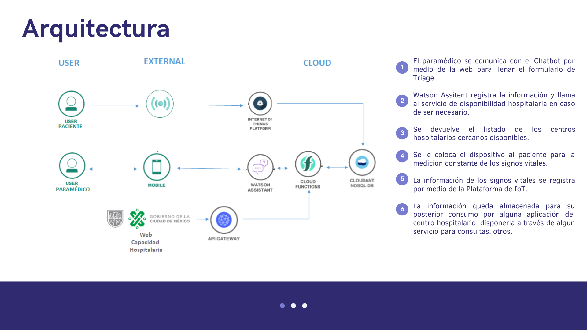
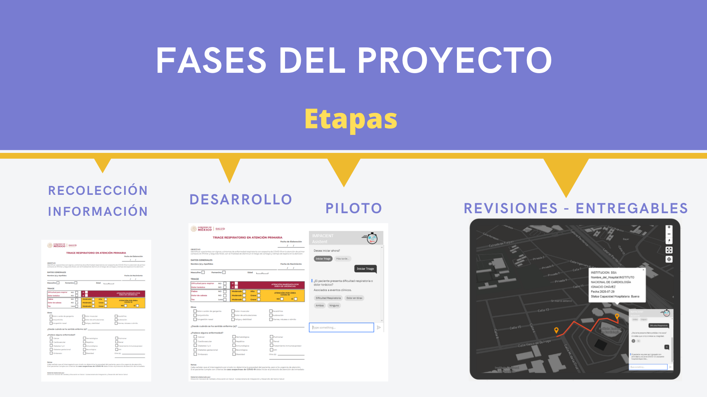

# Proyecto CallforCode 2020

## IMPACIENT.AI

## Contents

1. [Problema](#Problema)
1. [Solucion](#Solucion)
1. [Demo video](#demo-video)
1. [Architecture](#Arquitectura)
1. [Fases del Proyecto](#FasesdelProyecto)
1. [Getting started](#getting-started)
1. [Running the tests](#running-the-tests)
1. [Built with](#built-with)
1. [Authors](#authors)
1. [License](#license)

### PROBLEMA

Saturación de Centros hospitalarios, recursos limitados y personal de atención, debido a la gran cantidad de casos por COVID-19 manifestados a nivel mundial.

Nos identificamos con los Centros Reguladores de Urgencias Médicas (CRUM) en los Sistemas de Atención Médica de Urgencias (SAMU) y los Centros de Atención de Llamadas de Emergencias (CALLE) de Ciudad de México.

En su preocupación por la gran responsabilidad que tienen de asistir a las personas en casos de emergencias y trasladarlas en la brevedad posible al CRUM más cercano con capacidad disponible de atención para casos sospechosos O confirmados de COVID-19.

### SOLUCION

Impacient.ai, contempla: 

Chatbot que ayuda a la:
Automatización del llenado del formulario de Triage, permitiendo tener la información en digital al momento, evitando pérdida o contaminación en el traslado.
Identificación en tiempo real de los Hospitales más cercano con disponibilidad de atención, reduciendo el nivel de incertidumbre, optimizando el tiempo de atención.

Dispositivo con sensores que miden constantemente los signos vitales de la persona afectada, guardando el historial de su estado, para revisión de los médicos y registros estadísticos.
- Temperatura
- Pulsaciones
- Oxígeno en Sangre
- Tensión (TAS y TAD)
- Frecuencia Respiratoria

El Registro de los valores de los signos vitales de la persona afectada, permitiendo hacer estudios de históricos de la evolución del virus, asi como observar las variaciones durante el traslado.

## Demo video

## Arquitectura

## Fases del Proyecto

## 7th Place / Top Ten (+900 proyects)

## Certificados

## Built with

* [IBM Cloudant](https://cloud.ibm.com/catalog?search=cloudant#search_results) - The NoSQL database used
* [IBM Cloud Functions](https://cloud.ibm.com/catalog?search=cloud%20functions#search_results) - The compute platform for handing logic
* [IBM API Connect](https://cloud.ibm.com/catalog?search=api%20connect#search_results) - The web framework used

## Autores

* **Elsa Franzuly Figueroa** -Ingeniero en Sistemas - [PurpleBooth](https://www.linkedin.com/in/franzulyfigueroa/)
* **Jorge Fandiño** - Ingeniero Electrónico - [PurpleBooth](https://www.linkedin.com/mwlite/in/jorge-alberto-fandi%C3%B1o-santana-a72868163)
* **Jose Pablo Mendoza Jiménez** Ingeniero en Sistemas - [PurpleBooth](https://www.linkedin.com/in/jos%C3%A9-pablo-mendoza-jim%C3%A9nez-a3924517a/)
* **Franco Espildora** - Ingeniero Electrónico - [PurpleBooth](https://www.linkedin.com/in/franco-xavier-espildora-4aa288b5)
* **Eduardo Garcia M.** - Ingeniero en Computacion - [PurpleBooth](https://www.linkedin.com/in/eduardogarciam/)

## License

This project is licensed under the Apache 2 License - see the [LICENSE](LICENSE) file for details

